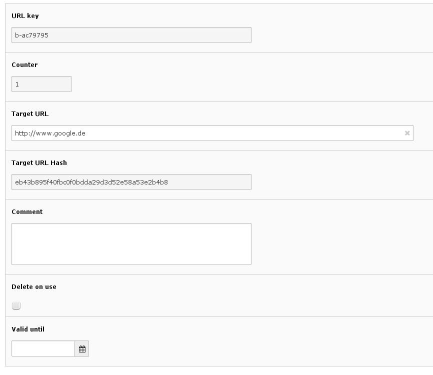

.. ==================================================
.. FOR YOUR INFORMATION
.. --------------------------------------------------
.. -*- coding: utf-8 -*- with BOM.

.. include:: ../Includes.txt

.. _introduction:

Introduction
============

.. _what-it-does:

What does it do?
----------------

It converts a normal URL to a tiny URL. It works similar as services provided by https://bitly.com/
or http://tinyurl.com/ .

It has multiple integration options. You can create tiny URLs in the backend by adding a tiny URL
database record. You can convert any typolink to a tinyurl by simply adding some configuration
options. And you can use the API of this extension to create tiny URLs in your own extensions.

.. _screenshots:

Screenshots
-----------

Settings for a tiny URL in the Backend;

Usage
-----

You can either use the extension as an administrator / integrator by using additional TypoScript
(see :ref:`admin-manual` section) or as a developer by using the API of the extension (see
:ref:`developer` section).

In-depth information
--------------------

.. toctree::
   	:maxdepth: 5
   	:titlesonly:
   	:glob:

   	AboutTinyUrlKeys/Index
